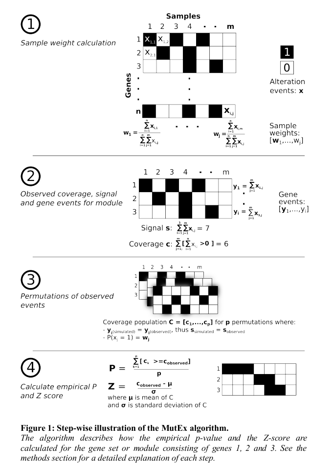

# MutEx
a simple algorithm to estimate the significance of a mutual exclusive pattern or co-occurrence

## dependencies

 - scipy 0.17 or higher
 - pandas 0.17 or higher
 - numpy 1.10.4

 - joblib
 - multiprocessing

## citations

## provenance
This is the python implementation of the MutEx algorithm described in the PhD Thesis "Analysis and visualization of multidimensional cancer genomics data" : http://www.tdx.cat/handle/10803/301436

The same algorithm is also implement in Java in the Gitools software: http://www.gitools.org
